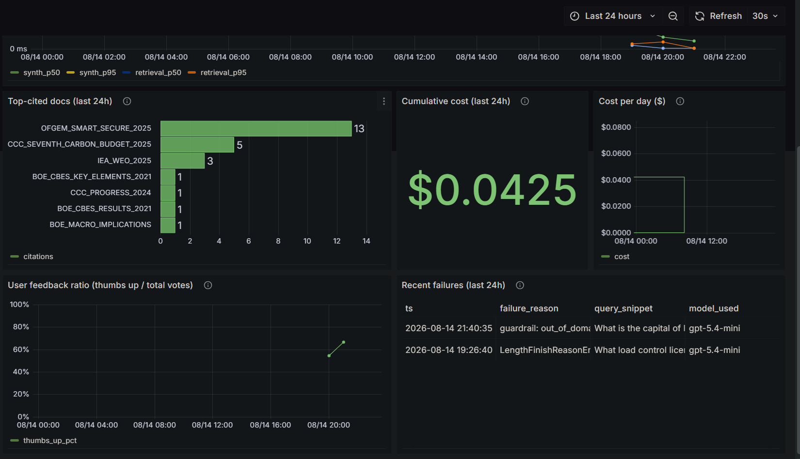

# CPIE — Climate Policy Intelligence Engine


Domain-aware RAG system that reads 12 UK and global climate policy PDFs and
returns structured analyst briefs with verified citations, so policy researchers
can act on regulatory signals without reading hundreds of pages themselves.

---

## Problem

Climate finance analysts must track regulatory signals from Ofgem, FCA, DESNZ,
IPCC, and IEA across hundreds of pages of dense documentation. Signals are
missed or acted on late because there is no fast, verifiable way to query across
multiple sources simultaneously.

**CPIE output — a structured brief per query:**

```json
{
  "answer": "Ofgem proposes that load control providers hold a Class B licence...",
  "citations": [
    { "doc_id": "OFGEM_SSES_2024", "passage": "...", "page": 14 }
  ],
  "contradictions": []
}
```

---

## Pipeline

The entire RAG pipeline for the project is organised into five stages. Stage 1 (Ingestion) runs once offline to
build the search indices; Stages 2–5 execute on every query.

<p align="center">
  
</p>

### Stage 1 — Ingestion (offline)

PDFs are extracted with PyMuPDF, cleaned of layout noise (ESO nav elements,
Ofgem security stamps), and split into sliding-window chunks. A **dlt pipeline**
writes chunks into DuckDB. `build_indices.py` reads from DuckDB to produce two
search indices used at query time: a **BM25 index** (keyword matching) and a
**Chroma vector store** (dense semantic embeddings).

<p align="center">
  
</p>

| Parameter | Value |
|---|---|
| Chunk size | 400 tokens |
| Overlap | 80 tokens |
| Floor / ceiling | 50t / 512t |
| Embedding model | BAAI/bge-base-en-v1.5 (768-dim) |
| Vector store | Chroma (`cpie` collection) |

---

### Stage 2 — Retrieval

Each query is first scanned for named institutions (Ofgem, FCA, IEA, BoE, CCC,
DESNZ, ESO). Matching institutions pre-filter both retrievers before RRF fusion.

<p align="center">
  
</p>

| Component | Choice | Reason |
|---|---|---|
| BM25 | rank-bm25 | Exact keyword match on institution names, policy codes |
| Dense | BAAI/bge-base-en-v1.5 | Mean cosine 0.543 vs 0.278 for all-MiniLM (ablation) |
| Fusion | RRF k=60 | Cormack et al. 2009 default; no score normalisation needed |
| Reranker | Not active | Reorders chunks by relevance, but hybrid retrieval already ranks well — 5.2× latency, zero downstream Correctness gain (ablation) |

---

### Stage 3 — Synthesis

Retrieved chunks and the original query are passed to GPT-5.4-mini with a
structured output schema (`LLMResponse`). The system prompt instructs the
model to answer only from the provided excerpts. If the excerpts don't contain
enough information, the model produces a parsed response whose `answer` field
says so — it does not fabricate. `message.refusal` is a separate OpenAI safety
mechanism (content policy) and is handled as a fallback, not the primary
refusal path.

CPIE follows the CRAG (Yan et al. 2024) framing of routing responses into
CORRECT / INCORRECT paths, though the mechanism is simpler: rather than a
separate evaluator model scoring retrieved documents, the same LLM that
synthesises the answer decides whether the chunks are sufficient and refuses
if they are not. A decision gate routes to one of two paths:

- **CORRECT** — LLM returns a substantive answer → validated, returned as `AnalystBrief`
- **INCORRECT** → canonical refusal (`"The corpus does not contain sufficient information…"`)

Three things trigger the INCORRECT path:

- **Zero chunks** — retriever returns nothing → short-circuit before the LLM call even happens
- **Primary refusal** — chunks retrieved → LLM parses them → `answer` field says "excerpts don't contain this"
- **`message.refusal`** — OpenAI safety system blocks the request at the API level (content policy); handled as a separate fallback

After synthesis, every cited passage is matched against the retrieved chunks
(substring anchor check). Any citation whose passage cannot be found in the
retrieved set is dropped — this is the anti-hallucination step that prevents
the model from inventing plausible-sounding but fabricated sources.

<p align="center">
  
</p>

| Component | Choice | Reason |
|---|---|---|
| Synthesis model | GPT-5.4-mini | +0.09 Correctness, +0.25 Faithfulness vs gpt-4o-mini; −26% latency (A/B) |
| Prompt | v2_numeric | Adds "verbatim value extraction" instruction; best aggregate Correctness, no regressions |
| Output schema | Pydantic `AnalystBrief` | Structured outputs — `answer`, `citations[]`, `contradictions[]` |

---

### Stage 3b — Agent Route (cross-document queries)

Cross-document queries — those requiring comparison or synthesis across multiple
institutions — are routed to a 7-node LangGraph agent instead of the fast path.
The agent decomposes the query into factual sub-questions, retrieves evidence per
sub-question, grades coverage deterministically, and synthesises a verified brief.

```
Router → cross_doc? ──► Planner → Retriever → Grader ──► Claim Builder → Verifier → Synthesiser
                                       ▲             |
                                       └─ retry ◄────┘  (not_covered only, max 1 retry)
```

**Planner** (GPT-4o-mini): decomposes the query into ≤6 factual sub-questions.
Comparison sub-questions are excluded — the synthesiser handles cross-source
comparison from factual evidence.

**Grader** (cross-encoder `ms-marco-MiniLM-L-6-v2`): scores each `(sub-question,
passage)` pair; takes the maximum score across all retrieved passages. Deterministic
— no LLM call. Thresholds calibrated on CPIE corpus via t-distribution (n=4 probe
queries):

| Score | Decision |
|---|---|
| ≥ 3.63 | covered — proceed |
| ≥ −2.3 | partial — proceed with available evidence |
| < −2.3 | not\_covered — retry with enriched query (parent + sub-question) |

**Retry logic:** only `not_covered` sub-questions trigger a retry. `partial`
proceeds to claim builder — evidence exists, the synthesiser notes gaps.
`RETRY_LIMIT = 1`.

**Claim Builder** (GPT-4o-mini): extracts structured claims from covered/partial
sub-questions. Each claim must cite ≥1 chunk_id visible in the retrieved passages.

**Verifier** (deterministic): drops claims whose `evidence_ids` are not present in
`state["retrievals"]`. No semantic matching — a set-membership check against chunk_ids
that were actually retrieved. Prevents chunk_id hallucination without an LLM call.

**Synthesiser** (GPT-4o-mini): produces an `AnalystBrief` from verified claims.

**Budget caps** (hard stops before each node):

| Budget | Cap |
|---|---|
| Steps | 14 |
| Wall time | 60s |
| Cost | $0.05 |
| Retries per sub-question | 1 |

**Feature flag:** `AGENT_ROUTE_ENABLED=false` in `.env` forces all queries to the
fast path. Default: `true`.

#### Agent A/B results (n=3 cross-document queries, preliminary)

| Metric | Fast path | Agent | Δ |
|---|---|---|---|
| Correctness (1–5) | 4.33 | **4.67** | +0.34 |
| Completeness (1–5) | 3.67 | **4.67** | +1.00 |
| Mean cost | $0.0076 | $0.0137 | 1.8× |
| Mean latency | 6.1s | 24.5s | 4× |
| Completion rate | — | **100%** | — |

Baseline (52-question offline eval, fast path only): cross-doc Correctness 3.50,
cross-doc Completeness 2.75. Agent A/B queries are a separate harder set.

*n=3 is below the plan's n=30 target — treat as directional, not conclusive.
Two-week canary soak underway.*

---

### Stage 4 — Evaluation

CPIE uses two complementary evaluation tracks: **offline evaluation** run
against a fixed ground-truth dataset before deployment, and **online
monitoring** of live traffic captured through the production stack.

<p align="center">
  
</p>

#### Offline evaluation

52 hand-crafted QA pairs across all 12 documents (29 factual, 8 numeric,
4 cross-document, 9 out-of-corpus negatives, 2 summarisation) — written
before running the system on them.

**Retrieval metrics** (hybrid BM25 + dense + RRF, institution metadata filter)

| Metric | Score |
|---|---|
| Recall@5 | **0.907** |
| MRR@5 | 0.884 |
| nDCG@5 | 0.894 |
| Hit@5 | 0.953 |
| Precision@5 | 0.722 |

**Recall@5 is the primary metric for this system.** A chunk missed at retrieval
is unrecoverable, the LLM can only synthesise from what it receives, so a
missed relevant chunk always produces a wrong or refused answer regardless of
how good the system prompt is. A false positive (irrelevant chunk included)
is tolerable: the LLM filters noise and the citation verifier drops fabricated
passages. This asymmetry, a miss is fatal and noise is manageable, makes Recall
the right thing to optimise. MRR and nDCG measure rank position within the top
5, which matters for search UIs where users scan results; CPIE sends all top 5
to the LLM at once so rank within that set has no effect on output quality.

**Business justification:** CPIE's users are climate finance analysts tracking
regulatory signals across hundreds of pages on a deadline. A missed signal, a
liability threshold buried in an Ofgem consultation, a new BoE stress-test
scenario can mean a misaligned investment decision or a compliance gap. The
cost of a false negative (analyst acts on incomplete information) far outweighs
the cost of a false positive (analyst reads one extra citation). A Recall@5 of
0.907 means the system surfaces the right evidence 9 times out of 10, the
remaining gap is the honest case for keeping a human in the loop.

**LLM-as-judge** (GPT-5.4-mini, 4-dimensional rubric, 1–5 scale; shipped config: v2\_numeric prompt)

| Metric | Overall | Factual | Numeric | Cross-doc | Negative |
|---|---|---|---|---|---|
| Correctness | **4.13** | 4.14 | 4.25 | 3.50 | — |
| Faithfulness | **4.37** | 4.52 | 4.62 | 3.50 | — |
| Completeness | **3.33** | 3.07 | 3.75 | 2.75 | — |
| Refusal appropriateness | **4.85** | — | — | — | 4.11 |

Out-of-corpus negatives correctly handled: **77.8%** (7/9).

Evaluation scripts: `src/evaluation/retrieval_eval_runner.py` (retrieval metrics), `src/evaluation/judge_runner.py` (LLM-as-judge).
Ground truth: `data/eval/ground_truth.json`. Results: `data/eval/results/`.

#### Online evaluation (live traffic)

Every production query is logged to Postgres and surfaced in Grafana. Online
metrics complement the static ground-truth run by catching quality drift on
real user queries over time.

| Online metric | How it is measured |
|---|---|
| Refusal rate | `is_refusal = true` rows / total queries over time |
| Latency (p50 / p95) | `retrieval_latency_ms` + `synthesis_latency_ms` per query |
| Cost per query / per day | `cost_usd` field, aggregated daily |
| Citation count | Mean `citation_count` per answered query |
| User satisfaction | Thumbs up / (thumbs up + thumbs down) from `cpie.user_feedback` |
| Top-cited documents | Most frequent `doc_id` values in `cited_doc_ids` |
| Failure reasons | Breakdown of `failure_reason` field (empty retrieval, LLM refusal, cost limit) |

---

### Stage 5 — Monitoring (online evaluation infrastructure)

Every query is dual-written to `logs/queries.jsonl` (primary fallback) and
`cpie.query_logs` (Postgres, feeds Grafana). The Streamlit UI writes thumbs
feedback to `cpie.user_feedback`. This is the infrastructure that powers
the online evaluation metrics described in Stage 4.

<p align="center">
  
</p>

<p align="center">
  
</p>

Grafana dashboards (auto-provisioned, no manual setup):

| Panel | What it shows |
|---|---|
| Query volume | Queries per hour |
| Refusal rate | % is\_refusal over time |
| Latency percentiles | p50 synthesis + retrieval |
| Top-cited docs | Which sources get used |
| Cumulative cost | Total $ spend (last 24h, stat) |
| Cost per day | Daily $ spend over time |
| User feedback ratio | Thumbs up / total votes |
| Recent failures | Failure reason + query snippet |

Start the monitoring stack: `docker compose up -d postgres grafana`

#### Monitoring catching a production bug

The Grafana **Recent failures** panel surfaced a `LengthFinishReasonError` on a
legitimate corpus query ("What load control licensing requirements does Ofgem
propose?") during live use. The Ofgem licensing response contains three detailed
citations and a multi-paragraph answer, the previous `max_completion_tokens=800`
limit truncated the JSON mid-stream. The OpenAI SDK raised `LengthFinishReasonError`
before the response could be parsed, and the exception propagated as a raw pipeline
failure rather than a graceful refusal.

The Grafana failure panel surfaced this within seconds of the query being logged.
The fix, catching `LengthFinishReasonError` explicitly in `synthesiser.py` and
returning a canonical refusal with a distinct `failure_reason`, was applied
immediately. `MAX_TOKENS` was already at 2000 (bumped from 800 in a prior session);
the exception handler adds defence-in-depth for any response that would exceed the
current limit.

This is a concrete illustration of why online monitoring complements offline
evaluation: the 52-query ground truth had no QA pair for this failure mode, but a
single live query exposed it immediately.

---

## Corpus

12 public documents from UK and global climate regulators:

| Document | Institution | Year |
|---|---|---|
| Smart Secure Electricity Systems (SSES) | Ofgem | 2024 |
| ZEV Mandate | DESNZ | 2023 |
| World Energy Outlook 2025 | IEA | 2025 |
| CBES Results | Bank of England | 2022 |
| CBES Key Elements | Bank of England | 2021 |
| Measuring Climate Risk | Bank of England | 2020 |
| BoE Climate Disclosure | Bank of England | 2024 |
| BoE Macro Implications | Bank of England | 2024 |
| CCC Progress Report 2024 | Climate Change Committee | 2024 |
| CCC Progress Report 2025 | Climate Change Committee | 2025 |
| Seventh Carbon Budget | Climate Change Committee | 2025 |
| Beyond 2030 | ESO | 2024 |

---

## Quick Start

### Prerequisites

- Docker + Docker Compose
- OpenAI API key (`OPENAI_API_KEY`)
- `uv` — install with `pip install uv` or `curl -LsSf https://astral.sh/uv/install.sh | sh`

### Step 1 — Clone and install

```bash
git clone https://github.com/AshishSiwach/Climate-Policy-Intelligence-Engine.git cpie
cd cpie
make install
```

### Step 2 — Add your API key

```bash
cp .env.example .env
# Required: set OPENAI_API_KEY=sk-...
# Optional: Postgres and Grafana variables have working local defaults already set
```

### Step 3 — Download corpus, ingest, and run

```bash
make data       # downloads 12 PDFs to data/raw/ (note: IEA WEO 2025 needs manual download — script prints instructions)
```

```bash
# Start monitoring stack (Postgres + Grafana)
docker compose up -d postgres grafana

# Ingest PDFs → DuckDB, build BM25 + Chroma indices
make ingest

# Run the Streamlit chat UI
make run
```

Open the app at **http://localhost:8501** and Grafana at **http://127.0.0.1:3000** (admin / admin).

### Docker (alternative)

Build and run the full stack including the app container:

```bash
docker build -t cpie .
docker compose up
```

---

## Design Decisions

### Corrective RAG (CRAG-style correction layer)

CPIE implements a coarse CRAG pattern (Yan et al. 2024) between retrieval and
synthesis. Rather than a separate evaluator model, the same synthesis LLM
decides whether retrieved chunks are sufficient:

- **CORRECT** — LLM returns a substantive answer → return `AnalystBrief`
- **INCORRECT** — triggered by zero chunks (short-circuit before LLM call),
  the LLM's `answer` field saying excerpts are insufficient, or `message.refusal`
  (OpenAI content-policy fallback) → return canonical refusal brief

Both paths are logged distinctly.

### Hybrid retrieval — BM25 + dense + RRF k=60

BM25 handles exact keyword matches (institution names, policy codes); dense
retrieval (BAAI/bge-base-en-v1.5, 768-dim) handles semantic equivalence.
RRF k=60 (Cormack et al. 2009) fuses ranked lists without score normalisation.
Embedding model chosen after ablation: mean cosine 0.543 vs 0.278 for
all-MiniLM-L6-v2.

### Institution metadata filter

The query text is scanned for named institutions (Ofgem, FCA, IEA, BoE, CCC,
DESNZ, ESO) before retrieval. Matching institutions pre-filter both the Chroma
collection and BM25 results. A/B result: cross-doc Completeness +1.0,
Recall@5 +0.03, Refusal_appropriateness +0.26. Added 18ms latency.

### Prompt versioning and A/B testing

Three prompt variants authored (v1, v2\_crossdoc, v2\_numeric) and tested
against the 52-query ground truth. `v2_numeric` shipped as default: adds a
"verbatim value extraction + page citation" instruction that improved aggregate
Correctness without regressing any metric. `v2_crossdoc` preserved in the
registry for per-query-type activation (future roadmap item).

### Reranker and query rewriting — measured and dropped

Both were built and A/B-measured against the eval dataset:
- **Reranker** (`cross-encoder/ms-marco-MiniLM-L-6-v2`): 5.2× retrieval
  latency, zero aggregate Correctness gain over hybrid.
- **Query rewriting** (GPT-4o mini paraphrase): cross-doc Correctness −0.75,
  Recall@5 −5pp, 3× latency.

Evidence in `docs/week5_failure_analysis.md`.

---

## Guardrails & Safety

Every query passes through three guardrails in sequence before retrieval or
synthesis runs. A query stopped by any guardrail returns the canonical refusal
immediately, no retrieval, no LLM synthesis, no wasted tokens.

| # | Guardrail | What it catches | Cost |
|---|---|---|---|
| 1 | Query length limit (500 chars) | Cost blow-up from very long inputs | Zero |
| 2 | Daily cost circuit breaker ($5/day) | Runaway API spend | Zero |
| 3 | Pre-retrieval domain gate (GPT-4o-mini) | Off-domain queries | ~$0.00003 / query |

### Domain gate

Prompt-level rules for refusing off-domain queries are brittle, patching one
failure mode (spelling requests) leaves gaps for arithmetic, CEO lookups, and
general-knowledge facts that coincidentally mention a corpus keyword. A
dedicated classifier is more general.

The gate is a GPT-4o-mini call (~120 tokens, ~$0.00003) that classifies the
query as in-domain or out-of-domain before any retrieval or synthesis runs.
It fails-open: any API error passes the query through to the normal pipeline.
The system prompt's Rule 6 ("do not answer from general knowledge") acts as
a second defence layer for anything that slips through.

### Stress testing results

A structured stress test was run across three categories after the system was
working end-to-end. Results drove the two fixes above.

**Parametric knowledge traps** — queries the LLM could answer from training
data; should always refuse:

| Query | Pre-fix | Post-fix |
|---|---|---|
| "What is the capital of France?" | ❌ Answered "Paris" with a fabricated CCC citation | ✅ Domain gate blocks |
| "What is the GDP of the UK?" | ⚠️ Refused the ask but cited unrelated GDP passages | ✅ Domain gate blocks |
| "Who is the CEO of BP?" | ⚠️ Refused but attached an IEA bibliography entry | ✅ Domain gate blocks |
| "What is 1+1?" | ❌ Answered "2" | ✅ Domain gate blocks |

**Partial corpus match** — corpus has related content but not the exact answer;
should answer from what exists without fabricating:

| Query | Result |
|---|---|
| "What is carbon pricing?" | ✅ Answered from BoE + CCC corpus passages |
| "What happened at COP26?" | ✅ Answered from CCC Seventh Carbon Budget with Glasgow Climate Pact detail |

**Legitimate corpus queries** — should answer fully with verified citations:

| Query | Result |
|---|---|
| "What aggregate losses did UK banks face under the CBES early action scenario?" | ✅ Surfaced the comparative figure (30% higher in Late Action, £110bn extra) |
| "What does Ofgem propose for load control licensing?" | ✅ 3 verified citations from OFGEM_SMART_SECURE_2025 |

---

## Known Limitations

- **No user-uploaded documents.** Corpus is fixed at 12 curated public PDFs.
  Accepting user content requires corpus-side prompt-injection scanning and
  per-user isolation.
- **No confidence signal.** Pipeline-derived confidence was removed after
  calibration (best AUC 0.668, overlapping random). Every answer carries
  a standing "verify against sources" caveat instead.
- **CCC Progress traffic-light indicators** do not extract as text from PDF
  (PyMuPDF limitation). The surrounding prose restates the assessment and
  carries the retrieval signal.
- **Agent route is cross-doc only (Phase 3).** Summary and contradiction routes
  are planned for Phase 5 but not yet built. Queries classified as `summary` or
  `contradiction` currently fall back to the fast path.
- **Contradiction detection is experimental.** The `contradictions[]` field is
  LLM self-report, not cross-doc claim verification. Treat as a hint.

---

## Project Structure

```
cpie/
  src/
    ingestion/       pdf_loader, chunker, dlt_pipeline
    retrieval/       bm25_retriever, dense_retriever, hybrid_retriever,
                     institution_detector, reranker (evaluated, not active),
                     query_rewriter (evaluated, not active)
    synthesis/       synthesiser, output_schema, query_classifier (domain gate)
    agent/
      router.py            complexity router — fast vs agent path
      workflow.py          LangGraph StateGraph (only file that imports langgraph)
      state.py             AgentState TypedDict
      policies.py          MAX_STEPS, MAX_COST, RETRY_LIMIT, RETRIEVER_TOP_K
      nodes/
        planner.py         decomposes query into factual sub-questions
        retriever.py       per-sub-question hybrid retrieval
        grader.py          cross-encoder coverage scoring (deterministic)
        claim_builder.py   extract structured claims from covered passages
        verifier.py        drop claims with hallucinated chunk_ids
        synthesiser.py     produce AnalystBrief from verified claims
    evidence/        Claim, Coverage, SubQuestion Pydantic models
    observability/   tracing.py — emit_span() to agent_traces table
    evaluation/      judge, eval_runner, retrieval_metrics
    monitoring/      logger (JSONL), db (Postgres)
  tests/             unit + integration tests
  data/eval/
    ground_truth.json          52 hand-crafted QA pairs
    cross_document_ground_truth.json  cross-doc A/B eval set
    results/                   eval run outputs + ablation tables
  monitoring/
    postgres/init.sql          schema DDL
    postgres/init_agent_traces.sql  agent_traces table DDL
    grafana/dashboards/        provisioned JSON (fast-path + agent dashboards)
    grafana/provisioning/      datasource + dashboard provider YAMLs
  docs/
    AGENT_ROUTE_PLAN.md          phased build plan for all agent routes
    AGENT_ROUTE_REASONING.md     why each route exists
    week5_failure_analysis.md    A/B evidence for every dropped component
    ai_engineering_decisions.md  full decision log with A/B results
    OPS_RUNBOOK.md               how to disable routing, inspect traces, reproduce queries
  scripts/
    ingest.py                  run dlt ingestion pipeline
    build_indices.py           build BM25 + Chroma from DuckDB
    download_data.py           fetch 12 corpus PDFs with SHA-256 verification
    calibrate_grader_threshold.py  cross-encoder threshold calibration
  app.py                       Streamlit chat UI
  main.py                      CLI entry point
  docker-compose.yml           postgres + grafana + app services
  Dockerfile                   containerised Streamlit app
```

---

## References

- Yan et al. (2024). *Corrective Retrieval Augmented Generation.* arXiv:2401.15884
- Cormack, Clarke & Buettcher (2009). *Reciprocal Rank Fusion outperforms Condorcet
  and individual rank learning methods.* SIGIR '09.
- BAAI/bge-base-en-v1.5 — [HuggingFace](https://huggingface.co/BAAI/bge-base-en-v1.5)
