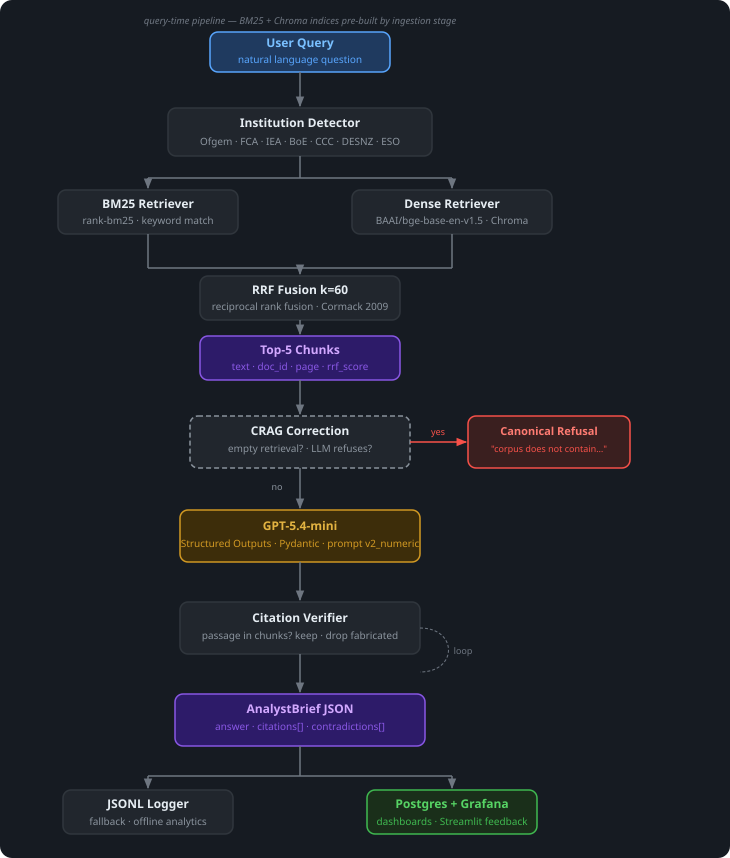
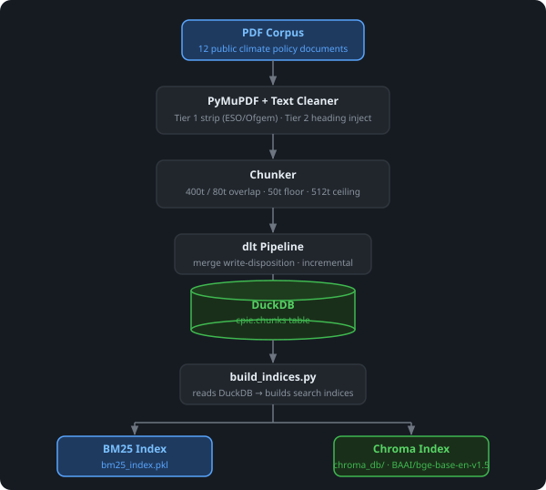
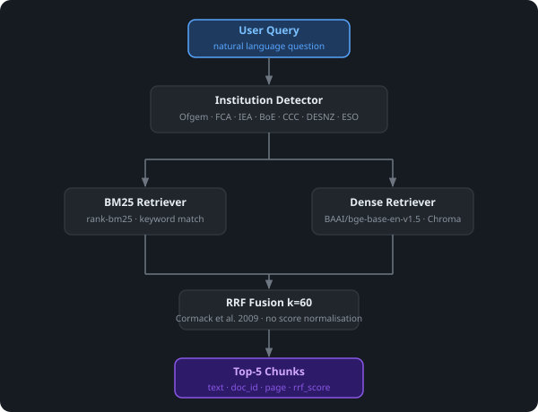
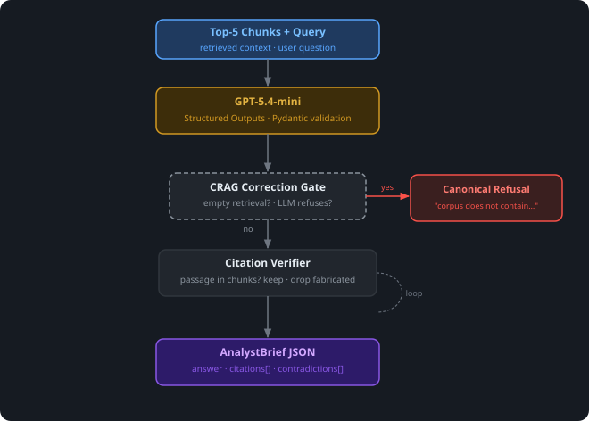
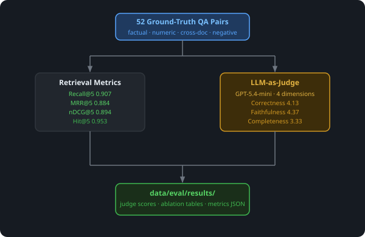
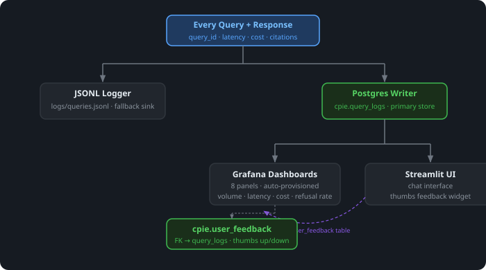

# CPIE — Climate Policy Intelligence Engine

Domain-aware RAG system that reads 12 UK and global climate policy PDFs and
returns structured analyst briefs with verified citations, so policy researchers
can act on regulatory signals without reading hundreds of pages themselves.

> **Disclaimer:** CPIE is an assistant, not a source of truth. Verify every
> citation against the source document before relying on it. CPIE does not
> provide investment, legal, or regulatory advice.

---

## Problem

Climate finance analysts must track regulatory signals from Ofgem, FCA, DESNZ,
IPCC, and IEA across hundreds of pages of dense documentation. Signals are
missed or acted on late because there is no fast, verifiable way to query across
multiple sources simultaneously.

**CPIE output — a structured brief per query:**

```json
{
  "answer": "Ofgem proposes that load control providers hold a Class B licence...",
  "citations": [
    { "doc_id": "OFGEM_SSES_2024", "passage": "...", "page": 14 }
  ],
  "contradictions": []
}
```

---

## Pipeline

CPIE is organised into five stages. Stage 1 (Ingestion) runs once offline to
build the search indices; Stages 2–5 execute on every query.

<p align="center">
  
</p>

### Stage 1 — Ingestion (offline)

PDFs are extracted with PyMuPDF, cleaned of layout noise (ESO nav elements,
Ofgem security stamps), and split into sliding-window chunks. A dlt pipeline
writes chunks into DuckDB. `build_indices.py` reads from DuckDB to produce the
BM25 pickle and Chroma vector store used at query time.

<p align="center">
  
</p>

| Parameter | Value |
|---|---|
| Chunk size | 400 tokens |
| Overlap | 80 tokens |
| Floor / ceiling | 50t / 512t |
| Embedding model | BAAI/bge-base-en-v1.5 (768-dim) |
| Vector store | Chroma (`cpie` collection) |

---

### Stage 2 — Retrieval

Each query is first scanned for named institutions (Ofgem, FCA, IEA, BoE, CCC,
DESNZ, ESO). Matching institutions pre-filter both retrievers before RRF fusion.

<p align="center">
  
</p>

| Component | Choice | Reason |
|---|---|---|
| BM25 | rank-bm25 | Exact keyword match on institution names, policy codes |
| Dense | BAAI/bge-base-en-v1.5 | Mean cosine 0.543 vs 0.278 for all-MiniLM (ablation) |
| Fusion | RRF k=60 | Cormack et al. 2009 default; no score normalisation needed |
| Reranker | Not active | 5.2× latency, zero aggregate Correctness gain (ablation) |

---

### Stage 3 — Synthesis

Retrieved chunks and the original query are passed to GPT-5.4-mini. CPIE
implements a CRAG-style (Yan et al. 2024) correction layer between retrieval
and synthesis:

- **CORRECT** — LLM does not refuse → synthesise and return `AnalystBrief`
- **INCORRECT** — empty retrieval or LLM emits `message.refusal` → canonical refusal

After synthesis, every cited passage is verified against the retrieved chunks;
fabricated citations are dropped.

<p align="center">
  
</p>

| Component | Choice | Reason |
|---|---|---|
| Synthesis model | GPT-5.4-mini | +0.09 Correctness, +0.25 Faithfulness vs gpt-4o-mini; −26% latency (A/B) |
| Prompt | v2_numeric | Adds "verbatim value extraction" instruction; best aggregate Correctness, no regressions |
| Output schema | Pydantic `AnalystBrief` | Structured outputs — `answer`, `citations[]`, `contradictions[]` |
| Confidence | Removed | AUC 0.668 on 47-query calibration — signals too weak to promise users |

---

### Stage 4 — Evaluation

CPIE uses two complementary evaluation tracks: **offline evaluation** run
against a fixed ground-truth dataset before deployment, and **online
monitoring** of live traffic captured through the production stack.

<p align="center">
  
</p>

#### Offline evaluation

52 hand-crafted QA pairs across all 12 documents (29 factual, 8 numeric,
4 cross-document, 9 out-of-corpus negatives, 2 summarisation) — written
before running the system on them.

**Retrieval metrics** (hybrid BM25 + dense + RRF, institution metadata filter)

| Metric | Score |
|---|---|
| Recall@5 | **0.907** |
| MRR@5 | 0.884 |
| nDCG@5 | 0.894 |
| Hit@5 | 0.953 |
| Precision@5 | 0.722 |

**LLM-as-judge** (GPT-5.4-mini, 4-dimensional rubric, 1–5 scale; shipped config: v2\_numeric prompt)

| Metric | Overall | Factual | Numeric | Cross-doc | Negative |
|---|---|---|---|---|---|
| Correctness | **4.13** | 4.14 | 4.25 | 3.50 | — |
| Faithfulness | **4.37** | 4.52 | 4.62 | 3.50 | — |
| Completeness | **3.33** | 3.07 | 3.75 | 2.75 | — |
| Refusal appropriateness | **4.85** | — | — | — | 4.11 |

Out-of-corpus negatives correctly handled: **77.8%** (7/9).

Evaluation scripts: `src/evaluation/eval_runner.py`, `src/evaluation/judge.py`.
Ground truth: `data/eval/ground_truth.json`. Results: `data/eval/results/`.

#### Online evaluation (live traffic)

Every production query is logged to Postgres and surfaced in Grafana. Online
metrics complement the static ground-truth run by catching quality drift on
real user queries over time.

| Online metric | How it is measured |
|---|---|
| Refusal rate | `is_refusal = true` rows / total queries over time |
| Latency (p50 / p95) | `retrieval_latency_ms` + `synthesis_latency_ms` per query |
| Cost per query / per day | `cost_usd` field, aggregated daily |
| Citation count | Mean `citation_count` per answered query |
| User satisfaction | Thumbs up / (thumbs up + thumbs down) from `cpie.user_feedback` |
| Top-cited documents | Most frequent `doc_id` values in `cited_doc_ids` |
| Failure reasons | Breakdown of `failure_reason` field (empty retrieval, LLM refusal, cost limit) |

---

### Stage 5 — Monitoring (online evaluation infrastructure)

Every query is dual-written to `logs/queries.jsonl` (primary fallback) and
`cpie.query_logs` (Postgres, feeds Grafana). The Streamlit UI writes thumbs
feedback to `cpie.user_feedback`. This is the infrastructure that powers
the online evaluation metrics described in Stage 4.

<p align="center">
  
</p>

Grafana dashboards (auto-provisioned, no manual setup):

| Panel | What it shows |
|---|---|
| Query volume | Queries per hour |
| Refusal rate | % is\_refusal over time |
| Latency percentiles | p50 synthesis + retrieval |
| Top-cited docs | Which sources get used |
| Cost per day | Cumulative $ spend |
| User feedback ratio | Thumbs up / total votes |
| Recent failures | Failure reason + query snippet |

Start the monitoring stack: `docker compose up -d postgres grafana`

---

## Corpus

12 public documents from UK and global climate regulators:

| Document | Institution | Year |
|---|---|---|
| Smart Secure Electricity Systems (SSES) | Ofgem | 2024 |
| ZEV Mandate | DESNZ | 2023 |
| World Energy Outlook 2025 | IEA | 2025 |
| CBES Results | Bank of England | 2022 |
| CBES Key Elements | Bank of England | 2021 |
| Measuring Climate Risk | Bank of England | 2020 |
| BoE Climate Disclosure | Bank of England | 2024 |
| BoE Macro Implications | Bank of England | 2024 |
| CCC Progress Report 2024 | Climate Change Committee | 2024 |
| CCC Progress Report 2025 | Climate Change Committee | 2025 |
| Seventh Carbon Budget | Climate Change Committee | 2025 |
| Beyond 2030 | ESO | 2024 |

---

## Quick Start

### Prerequisites

- Docker + Docker Compose
- OpenAI API key (`OPENAI_API_KEY`)
- `uv` — install with `pip install uv` or `curl -LsSf https://astral.sh/uv/install.sh | sh`

### Step 1 — Clone and install

```bash
git clone https://github.com/ashishsiwach2789/cpie.git
cd cpie
make install
```

### Step 2 — Add your API key

```bash
cp .env.example .env
# Open .env and set OPENAI_API_KEY=sk-...
```

### Step 3 — Ingest PDFs and run

Copy the 12 corpus PDFs into `data/raw/`, then:

```bash
# Start monitoring stack (Postgres + Grafana)
docker compose up -d postgres grafana

# Ingest PDFs → DuckDB, build BM25 + Chroma indices
uv run python scripts/ingest.py
uv run python scripts/build_indices.py

# Run the Streamlit chat UI
make run
```

Open the app at **http://localhost:8501** and Grafana at **http://localhost:3000** (admin / admin).

### Docker (alternative)

Build and run the full stack including the app container:

```bash
docker build -t cpie .
docker compose up
```

---

## Design Decisions

### Corrective RAG (CRAG-style correction layer)

CPIE implements a coarse CRAG pattern (Yan et al. 2024) between retrieval and
synthesis:

- **CORRECT** — LLM does not refuse → synthesise and return `AnalystBrief`
- **INCORRECT** — LLM emits `message.refusal`, or retrieval returns zero chunks
  → return canonical refusal brief (`"The corpus does not contain sufficient
  information…"`)

Both paths are logged distinctly. Not yet implemented: retriever-agreement gate
(replaces the deleted RRF-threshold short-circuit) and confidence layer
(removed after calibration showed AUC 0.668 — too weak to promise to users).

### Hybrid retrieval — BM25 + dense + RRF k=60

BM25 handles exact keyword matches (institution names, policy codes); dense
retrieval (BAAI/bge-base-en-v1.5, 768-dim) handles semantic equivalence.
RRF k=60 (Cormack et al. 2009) fuses ranked lists without score normalisation.
Embedding model chosen after ablation: mean cosine 0.543 vs 0.278 for
all-MiniLM-L6-v2.

### Institution metadata filter

The query text is scanned for named institutions (Ofgem, FCA, IEA, BoE, CCC,
DESNZ, ESO) before retrieval. Matching institutions pre-filter both the Chroma
collection and BM25 results. A/B result: cross-doc Completeness +1.0,
Recall@5 +0.03, Refusal_appropriateness +0.26. Added 18ms latency.

### Prompt versioning and A/B testing

Three prompt variants authored (v1, v2\_crossdoc, v2\_numeric) and tested
against the 52-query ground truth. `v2_numeric` shipped as default: adds a
"verbatim value extraction + page citation" instruction that improved aggregate
Correctness without regressing any metric. `v2_crossdoc` preserved in the
registry for per-query-type activation (future roadmap item).

### Reranker and query rewriting — measured and dropped

Both were built and A/B-measured against the eval dataset:
- **Reranker** (`cross-encoder/ms-marco-MiniLM-L-6-v2`): 5.2× retrieval
  latency, zero aggregate Correctness gain over hybrid. Per-query-type
  activation on numeric queries is a future candidate.
- **Query rewriting** (GPT-4o mini paraphrase): cross-doc Correctness −0.75,
  Recall@5 −5pp, 3× latency. Semantically-preserving paraphrases concentrated
  RRF votes on the same chunks, hurting diversity. Re-introduction requires
  HyDE-style rewrites.

Evidence in `docs/week5_failure_analysis.md`.

---

## Known Limitations

- **No user-uploaded documents.** Corpus is fixed at 12 curated public PDFs.
  Accepting user content requires corpus-side prompt-injection scanning and
  per-user isolation.
- **No confidence signal.** Pipeline-derived confidence was removed after
  calibration (best AUC 0.668, overlapping random). Every answer carries
  a standing "verify against sources" caveat instead.
- **CCC Progress traffic-light indicators** do not extract as text from PDF
  (PyMuPDF limitation). The surrounding prose restates the assessment and
  carries the retrieval signal.
- **Single-turn RAG.** One retrieval pass + one LLM call. Query decomposition,
  agentic loops, and iterative retrieval are future work.
- **Contradiction detection is experimental.** The `contradictions[]` field is
  LLM self-report, not cross-doc claim verification. Treat as a hint.
- **Streamlit app is not authenticated.** Anonymous single-user demo. Multi-tenant
  session tracking is future work.

---

## Project Structure

```
cpie/
  src/
    ingestion/       pdf_loader, chunker, dlt_pipeline
    retrieval/       bm25_retriever, dense_retriever, hybrid_retriever,
                     institution_detector, reranker (preserved, not active)
    synthesis/       synthesiser, output_schema
    evaluation/      judge, eval_runner, retrieval_metrics
    monitoring/      logger (JSONL), db (Postgres)
  tests/             unit + integration tests
  data/eval/
    ground_truth.json          52 hand-crafted QA pairs
    results/                   eval run outputs + ablation tables
  monitoring/
    postgres/init.sql          schema DDL
    grafana/dashboards/        provisioned JSON
    grafana/provisioning/      datasource + dashboard provider YAMLs
  docs/
    week5_failure_analysis.md  A/B evidence for every dropped component
    ai_engineering_decisions.md  full decision log with A/B results
  scripts/
    ingest.py                  run dlt ingestion pipeline
    build_indices.py           build BM25 + Chroma from DuckDB
  app.py                       Streamlit chat UI
  main.py                      CLI entry point
  docker-compose.yml           postgres + grafana + app services
  Dockerfile                   containerised Streamlit app
```

---

## References

- Yan et al. (2024). *Corrective Retrieval Augmented Generation.* arXiv:2401.15884
- Cormack, Clarke & Buettcher (2009). *Reciprocal Rank Fusion outperforms Condorcet
  and individual rank learning methods.* SIGIR '09.
- BAAI/bge-base-en-v1.5 — [HuggingFace](https://huggingface.co/BAAI/bge-base-en-v1.5)
